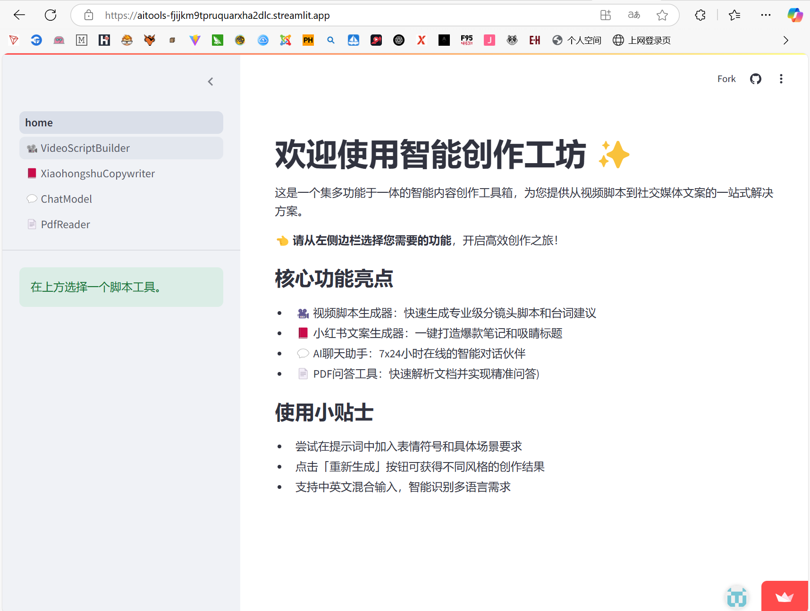
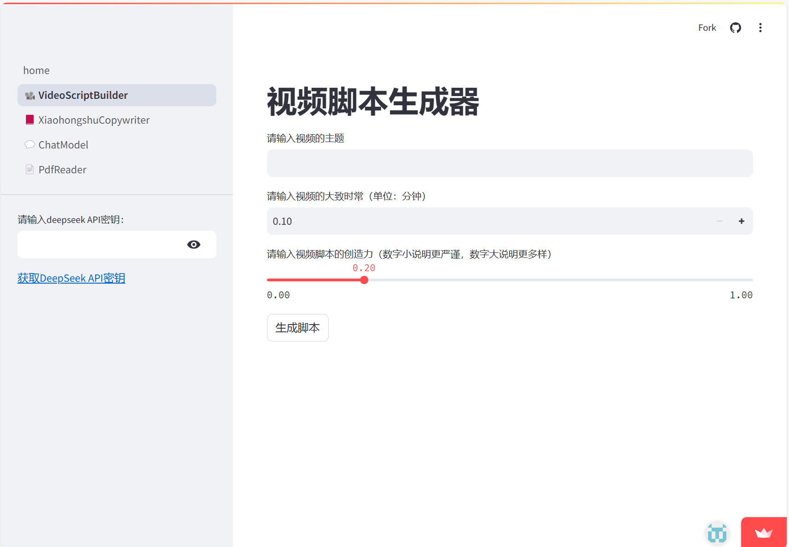
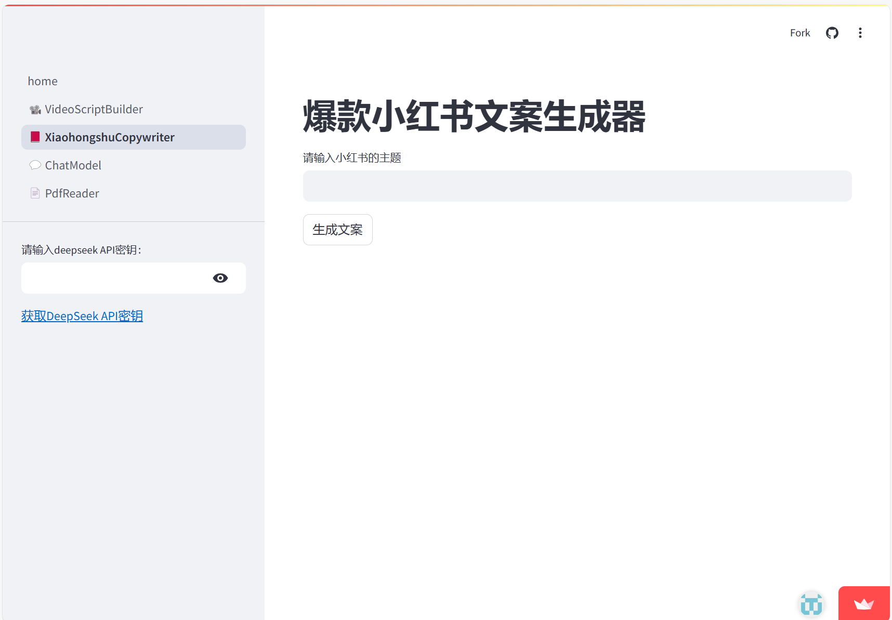
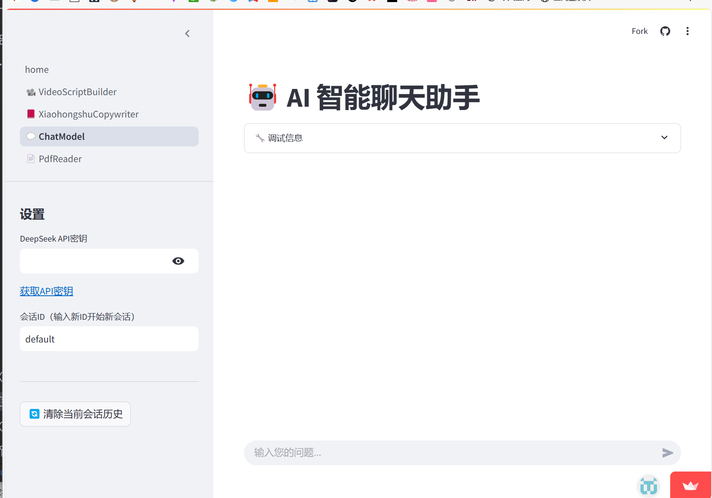
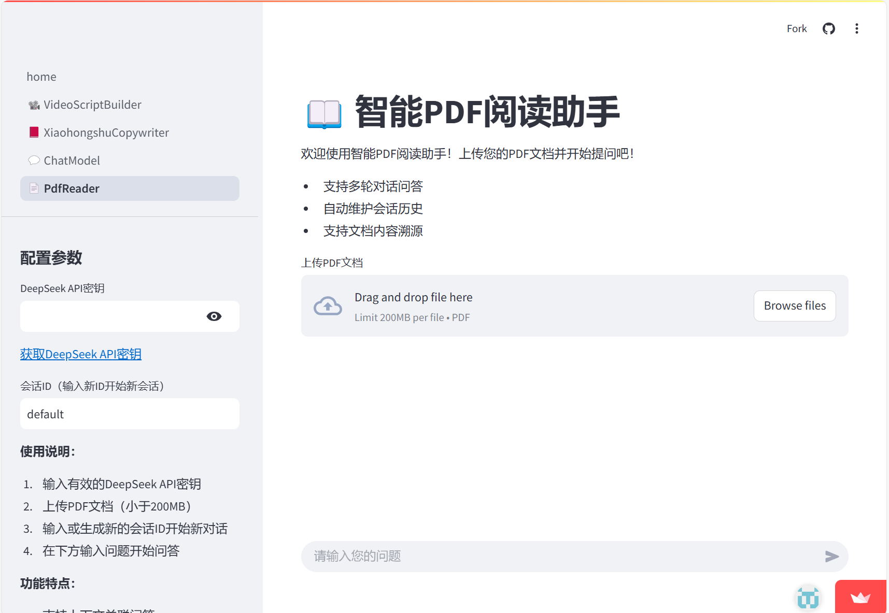

# AITools
ai工具箱（视频脚本生成，pdf读取，聊天机器人，小红书文案）
这是一个集多功能于一体的智能内容创作工具箱，为您提供从视频脚本到社交媒体文案的一站式解决方案。
#
体验链接：https://aitools-fjijkm9tpruquarxha2dlc.streamlit.app/
====

👈 请从左侧边栏选择您需要的功能，开启高效创作之旅！

核心功能亮点
-
---
>🎥 视频脚本生成器：快速生成专业级分镜头脚本和台词建议
>##

>📕 小红书文案生成器：一键打造爆款笔记和吸睛标题
>##
>
>💬 AI聊天助手：7x24小时在线的智能对话伙伴
>##
>
>📄 PDF问答工具：快速解析文档并实现精准问答)
>##
>
